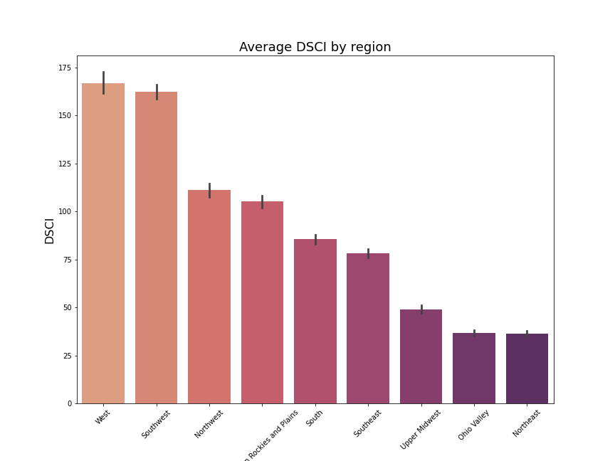
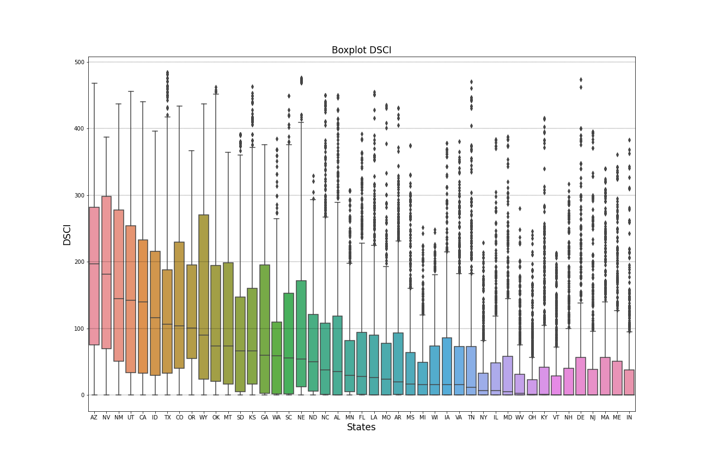
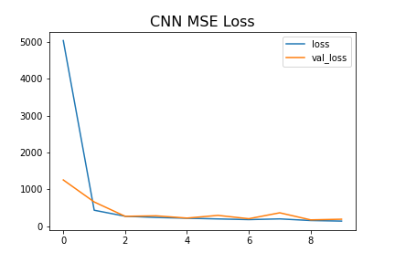
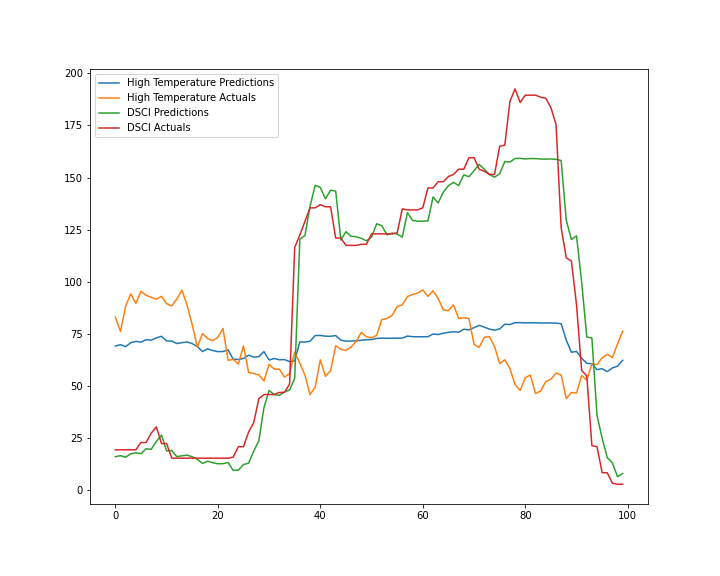

#  Project 5: Drought Analysis
### By: Julio Cesar Hernandez-Krol, Son Nguyen and David Castillo

## Executive Summary

### Problem statement

Climate change has brought on numerous problems, for the scope of this project we will tackle on drought.  Drought can impact our food resources, impact citizens in certain areas, our agricultural industries and needs to be addressed by policy makers.  We are looking to work on a datetime series neural networks model, where we use historical drought data  in order to predict future droughts from occurring. This model will be optimized via the rmse and val loss. The US Drought Monitor only looks back at historical data and this is a nice complement to what that provides since essentially this is an attempt at forecasting.  Additionally we have temperature and precipitation data from which we can gather plenty of inference and build on top of our model.

## Description of Dataset

### Datasets Collection

Dataset was obtained from the United States Drought Monitor website at https://droughtmonitor.unl.edu/DmData/DataDownload.aspx.  Also, the temperature and precipitation data attributed to Yuchuan Lai, at the institution of Carnegie Mellon University and was retrieved from https://kilthub.cmu.edu/articles/dataset/Assessment_of_historical_annual_temperature_and_precipitation_indices_change_in_the_U_S_cities/7961012.  

**USDM D Categories**

| Category |                                                                                                                                                                                                              Observed impacts                                                                                                                                                                                                              |
|----------|:------------------------------------------------------------------------------------------------------------------------------------------------------------------------------------------------------------------------------------------------------------------------------------------------------------------------------------------------------------------------------------------------------------------------------------------:|
|    D0    |     Forage   crops and pasture are stressed; producers feed livestock early     Ground   is hard  Agriculture   ponds and creeks begin to decline                                                                                                                                                                                                                                                                                          |
|    D1    | Cash crop growth and yield are low  National forests implement campfire and firework banks  Streams and ponds are low  Fire activity increases                                                                                                                                                                                                                                                                                             |
|    D2    | Crops are damaged, especially dryland corn  Burn Bans begin  Large Cracks appear in foundations of homes  Large Surface Water levels drop; agricultural ponds and streams have dried up  Saltwater intrusion occurs in rivers and bays; saltwater wildlife migrate upstream  Hydroelectric power decreases; navigation is limited                                                                                                          |
|    D3    | Soybean pods shatter  Large-scale hay shortages occur; producers sell livestock  Wildfire count and fire danger continue to increase  Landscape Growth is stunted and needs irrigation; Christmas Tree Growth is stunted  Ground has noticeable cracks; road damage has occurred  Low Flow in rivers and lakes affects recreation  Water mains break daily in large municipalities; water conservation is implemented  Air quality is poor |
|    D4    | Trees and shrubs are defoliated; grass is brown, landscaping projects are delayed  Wildfire counts is very high.        |                                                                                                                                                                                                 Courtesy of U.S. Drought Monitor        
 

### Data Dictionary
| Feature               | Type     | Dataset                  | Description                                |
|-----------------------|----------|--------------------------|--------------------------------------------|
| ValidEnd              | *object* | merged_drought_temp_prec | Date where the week ends.                  |
| Name                  | *object* | merged_drought_temp_prec | State Name(U.S)                            |
| state                 | *object* | merged_drought_temp_prec | State abbreviation(U.S)                    |
| area_none             | *float*  | merged_drought_temp_prec | Total area not affected                    |
| area_d0               | *float*  | merged_drought_temp_prec | Total area under D0                        |
| area_d1               | *float*  | merged_drought_temp_prec | Total area under D1                        |
| area_d2               | *float*  | merged_drought_temp_prec | Total area under D2                        |
| area_d3               | *float*  | merged_drought_temp_prec | Total area under D3                        |
| area_d4               | *float*  | merged_drought_temp_prec | Total area under D4                        |
| population_none       | *float*  | merged_drought_temp_prec | Total population not affected              |
| population_d1         | *float*  | merged_drought_temp_prec | Total population under D0                  |
| population_d2         | *float*  | merged_drought_temp_prec | Total population under D1                  |
| population_d2         | *float*  | merged_drought_temp_prec | Total population under D2                  |
| population_d3         | *float*  | merged_drought_temp_prec | Total population under D3                  |
| population_d4         | *float*  | merged_drought_temp_prec | Total population under D4                  |
| DSCI                  | *int*    | merged_drought_temp_prec | Drought Severity and Coverage Index        |
| total_area            | *float*  | merged_drought_temp_prec | Total area impacted D0-D4                  |
| total_population      | *float*  | merged_drought_temp_prec | Total population impacted D0-D4            |
| avg_tmax              | *float*  | merged_drought_temp_prec | Average max temperature                    |
| avg_tmin              | *float*  | merged_drought_temp_prec | Average minimum temperature                |
| total_avg_prcp_inches | *float*  | merged_drought_temp_prec | Total average precipitation in inches      |
| total_avg_prcp_mm     | *float*  | merged_drought_temp_prec | Total average precipitation in millimeters |
| climate_regions       | *float*  | merged_drought_temp_prec | One of the 9 United States climate regions |

### Background Research
**Climate Change**

A collection of more than 200 leading health and medical journals declared a rise in global temperatures as the greatest threat to global public health(Choi-Schagrin, 2021). Rising global temperatures are just one of the many effects to be weary of with regard to climate change.  Climate change is often only spoken of as it regards to predictions made by computer models and also have a broader scientific basis in which models are just one part of the foundation(Rosen, 2021).

We have also seen other effects such as; ice sheets and glaciers shrinking while sea levels are rising, artic sea ice is disappearing, snow melts sooner, plants flower earlier.  Also, droughts, floods and wildfires have all become more extreme.(Rosen, 2021).

Climate can vary and some years are hotter/colder than others, some decades can bring about more hurricanes, and  long droughts have spanned during prior centuries.  However researchers have access to records that can give them data from over 1000 years.  Researchers have access to geologic records like tree rings, ice cores, corals and sediments that preserve information about prehistoric climates from long ago(Rosen, 2021). Global temperatures have been flat for centuries, but has taken a sharp turn upwards in the last 150 years(Rosen, 2021). There is also the increase in frequency and severity of phenomena like heat waves, floods and droughts.

**Droughts**

A drought can be generally understood as "a period of abnormally dry weather that goes on for long enough to have an impact on water supplies, farming, livestock operations, energy production and other activities"(Fountain, 2021). Droughts begin with less than normal precipitation which varies depending on the region. At the root of droughts are warmer temperatures and changing precipitation patterns, which are linked to emissions of carbon dioxide and other greenhouse gases into the atmosphere, where they trap the sun's heat(Fountain,2021). Excessive heat from climate change leads to winter snowpack melting faster affecting the availability of water throughout the year(Fountain,2021).

With respect to droughts, climate change has worsened them through the increasing evaporation, which has also lead to increased crop failures and risk of severe wildfires(Fountain,2021). According to the analysis of soil moisture content, "the drought that afflicted the American Southwest from 2000 to 2018 was almost 50 percent more severe because of climate change"(Fountain, 2020).  It was the worst drought in the region in over 1000 years(Rosen, 2021). Conditions are also of historic proportions in California, into the Pacific Northwest, much of the Intermountain West, and even the Northern Plains(Fountain, 2021).

While it is true that the southwest and parts of southern California are desert, this makes them more sensitive to changes in precipitation patterns. What would have been moderate droughts are now made severe due to the aforementioned increase in temperatures and shifts in precipitation.  

**United States Drought Monitor(USDM)**

The USDM is a collaboration of several federal agencies and the University of Nebraska-Lincoln(Fountain,2021).  They assess the severity of drought in a given area, ranking it from moderate to exceptional. They take into account, precipitation totals, snowpack, stream flows and soil moisture measurements, and use images from satellites to assess the health of vegetation(Lincoln, 2021).  Naturally it is then used by local state, federal & tribal agencies, individuals, policymakers, task forces, organizations, businesses and industries.  They use it in part to make public health advisories, have drought response triggers at various municipal levels, efficient water supply monitoring, fire precaution levels, federal agricultural relief, loans, and tax purposes(USDM).

It is important to recognize droughts in order to reduce its dangerous and economic impacts. The USDM uses various measures such as comparing observed precipitation with whats normal(climatologic), comparing soil moisture and crop conditions with what's normal(agricultural), or by looking at water contained in snow, the level or flow rate of moving water, water in reservoirs, etc(USDM).

The USDM website itself explains that its map identifies areas of drought and labels them by intensity. D1 is the least intense level and D4 the most intense. D0 areas are not in drought, but are experiencing abnormally dry conditions that indicate a possible turn into drought or recently recovering from a drought but not quite back to normal.  

The USDM includes Standardized Precipitation Index(SPI), Palmer Drought Severity Index(PDSI), USGS Weekly Streamflow(percentiles), CPC Soil Moisture Models(percentiles) and Objective Drought indicator blends(percentiles).  The USDM relies on experts to synthesize this data and work with local observers to interpret the information.  The USDM makes clear that it is not a forecast, it looks backward which is why we thought it would be good to add a predictive component to this tool via a Date Time Series model.

The Drought Severity and Coverage Index(DSCI) is a method for converting drought levels from the Drought Monitor map to a single value for an area.  The DSCI ranges from 0 to 500 where 0 indicates that none of the area is abnormally dry or in drought, and 500 indicates that all areas are in D4(exceptional drought)(n.d Drought Monitor).

")

**Precipitation**

We also wanted to include precipitation data as we wanted to explore the relationships between this and droughts.  In the United States there is a big variance in terms of regions that are wet and dry.  It is not uncommon for a tropical storm to deliver record-breaking rain in a city like New York, or how flash floods can devastate a place like central Tennessee(Bhatia & Popovich, 2021).  The opposite is true in the west where there is a longterm precipitation shortfall, it is a case of two extremes worsening(Bhatia & Popovich, 2021). In fact "precipitation is one of the key climate variables", wheree changes in precipitation in either direction are getting bigger"(Dai, 2021).

**Temperature**

Another indicator we wanted to pair with our data was temperature.  As we also have seen some troubling trends there.  This past summer was the hottest on record in the United States, exceeding even the Dust Bowl summer of 1936, per the National Oceanic and Atmospheric Administration(Patel, 2021). California, Idaho, Nevada, Oregon and Utah reported their warmest summers on record, while 16 other states had a top 5 warmest summer experience(Patel, 2021). This is not just a one time occurrence, as heat waves are becoming more frequent, long lasting and with more dangerous effects(Patel, 2021). The frequency of heatwaves has gone from about 2 a year in the 1960s to 6 for the 2010s(Patel, 2021).  The seven warmest years in the history of accurate global record-keeping have been the last seven years, with 19 of the last 20 years being the warmest on record(Patel, 2021).

**References**

* Bhatia, A & Popovich, N.(2021).America Today: Too Much Water, or Not Enough. Retrieved from https://www.nytimes.com/2021/08/25/climate/nyt-climate-newsletter-drought-floods.html

* Choi-Schagrin,W.(2021). Medical Journals Call Climate Change the 'Greatest Threat to Global Public Health'. Retrieved from https://www.nytimes.com/2021/09/07/climate/climate-change-health-threat.html

* Fountain, H.(2020). Southwest Drought Rivals Those of Centuries Ago, Thanks to Climate Change. Retrieved from https://www.nytimes.com/2020/04/16/climate/drought-southwest-climate-change.html

* Fountain, H.(2021). The Western Drought is Bad. Here's What You Should Know About It. Retrieved from https://www.nytimes.com/article/drought-california-western-united-states.html

* Fountain, H.(2021). Severe Drought, Worsened by Climate Change, Ravages the American West. Retrieved from https://www.nytimes.com/2021/05/19/climate/drought.html?action=click&module=RelatedLinks&pgtype=Article

* Patel, V.(2021). This summer was hotter than the Dust Bowl summer, NOAA says. Retrieved from https://www.nytimes.com/2021/09/09/us/hottest-summer-us-record.html

* Rosen, J.(2021). The Science of Climate Change Explained: Facts, Evidence and Proof. Retrieved from https://www.nytimes.com/article/climate-change-global-warming-faq.html

* (n.d.) U.S. Drought Monitor. What is the USDM. Retrieved from https://droughtmonitor.unl.edu/About/WhatistheUSDM.aspx

## Notebook organization
* code_notebook_dc contains collaborative code for the EDA process from David.
* data_dc contains the versions of the data that David worked with.
* Educational_experimental_dc were notebooks that were simply part of the iterative and educational process that are **not** directly relevant to the final version of the project.
* images is the source of the images used for the readme file as well as the presentation slides.

## Data Visualizations & Analysis

### Regional Visualizations

)")
 
We see DSCI peaks in the years ranging from 2002-2003, 2007 and 2012.

 
Regions with highest DSCI are the West, Southwest, Northwest and Norther Rocky & Plains.

')
 
Average Max temperatures are high across the years supporting the background research.

 
Higher average max temperatures can be seen in the southern regions; southeast, south and southwest.

")

 
To look for a relationship with drought we can look to the regions with the least amount of precipitation; west, southeast, northwest and northern rockies and plains.  

')

')

')

### State Visualizations

 
In these time series analysis of the regions we can see how the valleys in precipitation usually equate to rises in DSCI for the same time period.  The consistent wavelengths for temperature signify the change in seasons.

')

')

')

Great visualization for where the drought occurs across the last two decades.

## DateTime Series models

### LSTM Prediction Model

### CNN Prediction Model

### GRU Prediction Model

### LSTM Prediction Model(MV time)

Loss')

### LSTM Prediction Model(MV Time & High Temp)

')
## Conclusions

As we have been able to verify, temperature and precipitation are factors that significantly affect drought. We can also verify that drought and precipitation do not have a cycle or frequency like temperature.
After the analysis of the drought, we see that it varies depending on the region, for example the regions that are located in the south; We see that they have a higher degree of drought compared to the regions that are further north. If we analyze the states, we can see the same pattern of drought, with the exception of some cases where some states have a much higher peak than the average.

As far as modeling, CNN performed the best of all of our models. We will be able to use these techniques on other regions of the US.

We recommend that the drought monitor goes by daily DSCI measurements to get more accurate predictions and to test more multivariate models.

We need more data on the multivariate models.

### Next Steps

* Use modeling techniques at state levels.
* Add predictability function to streamlit app.
* Look for more robust temperature & precipitation dataset.
